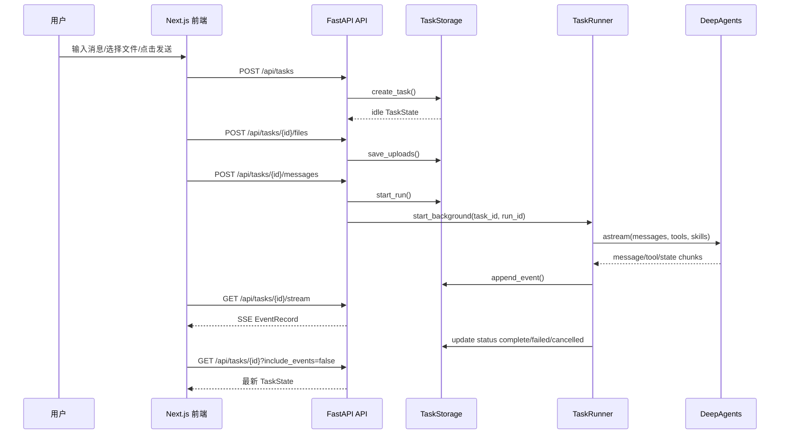

# 架构地图

## 一句话理解

MyAgent 是一个“任务驱动的本地优先 Agent 工作区”：

- 前端负责用户交互、上传、展示进度和产物。
- 后端 API 负责创建任务、校验请求、管理任务状态。
- Runner 负责一次 Agent 执行。
- Storage 负责持久化事实。
- DeepAgents 负责实际模型推理、工具调用和子任务协作。

## 核心目录地图

```text
backend/app/main.py                  FastAPI 应用入口、中间件、路由注册
backend/app/api/tasks.py             Task CRUD、发送消息、取消任务
backend/app/api/files.py             上传文件
backend/app/api/artifacts.py         下载产物
backend/app/api/streaming.py         SSE 流式事件
backend/app/schemas.py               后端公开数据结构
backend/app/storage.py               Postgres 任务存储与文件工作区
backend/app/runner/core.py           Agent run 生命周期编排
backend/app/agent/factory.py         create_deep_agent 包装
backend/app/streaming/*.py           LangGraph/DeepAgents 流式事件适配
backend/app/execution/resources.py   上传资源工具
backend/app/models/*.py              多模型 registry 和 provider

frontend/app/page.tsx                页面入口
frontend/components/chat/            聊天工作区组件
frontend/hooks/use-task-workspace.ts 前端任务状态编排
frontend/lib/task-api.ts             API 调用封装
frontend/app/task-state.ts           后端状态归一化与字段映射
frontend/app/workspace-view.ts       页面可见会话流和进度日志投影
```

## 用户发送一条消息的链路



这个图是主路径。真实代码里还有几个容易被忽略的分支：

- 如果用户只新建空 task，后端只校验模型是否在 registry，不启动 Runner。
- 如果用户带消息新建 task 或给已有 task 发消息，后端必须确认 provider key 可用。
- 如果自动标题生成失败，API 只记录 warning，不能阻止 `runner.start_background()`。
- SSE 断线时，前端会用 `/api/tasks/{id}/events?after_id=...` 补事件。

## 三个最重要的边界

1. API 边界：外部只通过 `/api/tasks...` 操作任务，不直接改 storage。
2. Runner 边界：只有 Runner 负责启动 Agent 并写终态事件。
3. Resource 边界：上传文件只在当前 task 的 `uploads/` 内可读，不能任意读宿主机路径。

## 读代码时的入口顺序

建议你按下面顺序打开文件，每读一个文件只回答一个问题：

| 文件 | 先回答的问题 |
| --- | --- |
| `frontend/components/chat/TaskWorkspace.tsx` | 页面由哪几个大组件拼起来？ |
| `frontend/hooks/use-task-workspace.ts` | 发送、停止、上传、打开产物分别由哪个 handler 负责？ |
| `frontend/lib/task-api.ts` | 前端调用了哪些后端 API？ |
| `backend/app/api/tasks.py` | task 生命周期路由如何防止重复运行？ |
| `backend/app/runner/core.py` | Runner 执行前注入了哪些上下文？ |
| `backend/app/storage.py` | run、event、artifact 的状态如何落库？ |
| `frontend/app/workspace-view.ts` | 原始日志如何变成可见进度？ |

## 已实现与规划边界

当前源码已经实现的是通用 Agent 平台：Task、Run、Event、Resource、Artifact、SSE、模型 registry、长期记忆等。

招投标 PDF 分析工作流在 `asset/bid_analysis_workflow_knowledge_pack.md` 和 `asset/tender_workflow_breakdown.md` 中有详细边界，但当前仓库没有完整的 `tender_pipeline.py`、`pdf_ingest.py`、`compare_result.py` 等生产模块。学习第 09 章时要把它当作“业务设计如何映射到平台”的案例，而不是已完整落地的代码。
