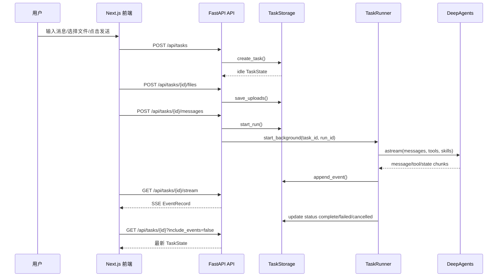

# 架构地图

## 一句话理解

MyAgent 是一个“任务驱动的本地优先 Agent 工作区”：

- 前端负责用户交互、上传、展示进度和产物。
- 后端 API 负责创建任务、校验请求、管理任务状态。
- Runner 负责一次 Agent 执行。
- Storage 负责持久化事实。
- DeepAgents 负责实际模型推理、工具调用和子任务协作。

## 核心目录地图

```text
backend/app/main.py                  FastAPI 应用入口、中间件、路由注册
backend/app/api/tasks.py             Task CRUD、发送消息、取消任务
backend/app/api/files.py             上传文件
backend/app/api/artifacts.py         下载产物
backend/app/api/streaming.py         SSE 流式事件
backend/app/schemas.py               后端公开数据结构
backend/app/storage.py               Postgres 任务存储与文件工作区
backend/app/runner/core.py           Agent run 生命周期编排
backend/app/agent/factory.py         create_deep_agent 包装
backend/app/tools/registry.py        平台工具注册入口
backend/app/tools/searxng_search.py  本地 SearXNG 联网搜索工具
backend/app/streaming/*.py           LangGraph/DeepAgents 流式事件适配
backend/app/execution/resources.py   上传资源工具
backend/app/models/*.py              多模型 registry 和 provider

frontend/app/page.tsx                页面入口
frontend/components/chat/            聊天工作区组件
frontend/hooks/use-task-workspace.ts 前端任务状态编排
frontend/lib/task-api.ts             API 调用封装
frontend/app/task-state.ts           后端状态归一化与字段映射
frontend/app/workspace-view.ts       页面可见会话流和进度日志投影
```

## 用户发送一条消息的链路



这个图是主路径。真实代码里还有几个容易被忽略的分支：

- 如果用户只新建空 task，后端只校验模型是否在 registry，不启动 Runner。
- 如果用户带消息新建 task 或给已有 task 发消息，后端必须确认 provider key 可用。
- 如果自动标题生成失败，API 只记录 warning，不能阻止 `runner.start_background()`。
- SSE 断线时，前端会用 `/api/tasks/{id}/events?after_id=...` 补事件。

## 两条最容易混淆的发送路径

第一次读代码时，很多人会把“API 支持的能力”和“当前前端实际怎么走”混在一起。可以先分成这两条：

### 路径 A：当前前端默认路径

```text
ensureTask()
-> POST /api/tasks 只创建空 task
-> POST /api/tasks/{id}/files 上传文件（如果有）
-> POST /api/tasks/{id}/messages 真正启动 run
```

### 路径 B：后端 API 还支持的简化路径

```text
POST /api/tasks 直接带第一条 message
-> create_task() 内部 start_run()
-> runner.start_background()
```

理解这两个分支之后，你就不会困惑：

- 为什么 `create_task()` 支持 `message` 为空
- 为什么 `send_message()` 又单独存在
- 为什么前端的 `ensureTask()` 和后端的 `create_task()` 不是一回事

## 四个最重要的边界

1. API 边界：外部只通过 `/api/tasks...` 操作任务，不直接改 storage。
2. Runner 边界：只有 Runner 负责启动 Agent 并写终态事件。
3. Resource 边界：上传文件只在当前 task 的 `uploads/` 内可读，不能任意读宿主机路径。
4. Web search 边界：联网搜索通过 `searxng_search` 调用后端配置的本地 SearXNG 引擎，默认地址是 `http://127.0.0.1:8181/`，不要再按外部搜索 API Key 路径理解搜索工具。

## 读代码时的入口顺序

建议你按下面顺序打开文件，每读一个文件只回答一个问题：

| 文件 | 先回答的问题 |
| --- | --- |
| `frontend/components/chat/TaskWorkspace.tsx` | 页面由哪几个大组件拼起来？ |
| `frontend/hooks/use-task-workspace.ts` | 发送、停止、上传、打开产物分别由哪个 handler 负责？ |
| `frontend/lib/task-api.ts` | 前端调用了哪些后端 API？ |
| `backend/app/api/tasks.py` | task 生命周期路由如何防止重复运行？ |
| `backend/app/runner/core.py` | Runner 执行前注入了哪些上下文？ |
| `backend/app/tools/registry.py` | 平台工具如何注册 resource tools 和 `searxng_search`？ |
| `backend/app/storage.py` | run、event、artifact 的状态如何落库？ |
| `frontend/app/workspace-view.ts` | 原始日志如何变成可见进度？ |

参考答案：

| 文件 | 参考答案 |
| --- | --- |
| `frontend/components/chat/TaskWorkspace.tsx` | 页面由 `ChatSidebar`、`TaskConversation`、`ChatComposer` 三个大组件拼起来。`TaskWorkspace` 自己不管理复杂业务，只调用 `useTaskWorkspace()` 拿状态和回调，再把它们传给子组件。 |
| `frontend/hooks/use-task-workspace.ts` | 发送由 `handleSubmit` 负责；停止由 `handleStop` 负责；选择上传文件由 `handleFileSelection` 负责；移除待上传文件由 `handleRemoveFile` 负责；打开产物由 `handleOpenArtifact` 负责；下载产物由 `handleDownloadArtifact` 负责；新建、选择、重命名、删除历史会话分别由 `handleNewConversation`、`handleSelectConversation`、`handleRenameConversation`、`handleDeleteConversation` 负责。 |
| `frontend/lib/task-api.ts` | 前端主要调用 `/api/models`、`/api/tasks`、`/api/tasks/{id}`、`/api/tasks/{id}/events`、`/api/tasks/{id}/files`、`/api/tasks/{id}/messages`、`/api/tasks/{id}/cancel`、`/api/tasks/{id}/stream`，以及 task/run artifact 下载路由。 |
| `backend/app/api/tasks.py` | 发送消息前先检查 task 存在、模型注册且可运行；如果 `runner.is_running(task_id)` 为真就返回 409；`storage.start_run()` 还会检查当前状态是否在允许集合内；删除 running task 也会返回 409。 |
| `backend/app/runner/core.py` | Runner 执行前会注入同一 task 的会话上下文、长期记忆上下文、上传资源 manifest，最后才追加当前 `HumanMessage`。资源 manifest 只包含文件元数据，不包含上传正文。 |
| `backend/app/tools/registry.py` | 有 task_id 时注册上传资源工具；只要 `settings.searxng_url` 非空就注册 `searxng_search`，默认指向本地 SearXNG。 |
| `backend/app/storage.py` | `start_run()` 创建 run 记录、写入用户消息、设置 task 为 `running` 和 `active_run_id`；`append_event()` 追加事件并递增 `seq`；artifact 通过 run-scoped artifact 目录、artifact names 和下载解析方法暴露；终态通过 `update_task_if_status_and_append_event()` 等方法在状态更新时一起写事件。 |
| `frontend/app/workspace-view.ts` | 原始 `ExecutionLog` 会先按展示顺序处理，`buildRunActivityGroups()` 把 logs/artifacts 按 run 分组，`buildLiveLogItems()` 把工具调用、工具结果、思考流、回答流、状态更新折叠成用户可读进度行，`buildConversationStreamItems()` 再把消息、run 进度和产物组织成会话流。 |

## 这页怎么验证

这张地图本身不带独立 `mini_unit`，但你可以用下面两个动作快速验证它没讲偏：

1. 打开 `frontend/hooks/use-task-workspace.ts`，确认当前前端确实先 `ensureTask()`，再 `uploadTaskFiles()`，再 `postTaskMessage()`。
2. 打开 `backend/app/api/tasks.py`，确认后端确实是 `storage.start_run()` 先创建 run，再把同一个 `run_id` 交给 `runner.start_background()`。

如果你只想先跑一个最短验证，再回来看这张图，建议先跑 `Study/chapters/00_minimal_runnable_example/mini_unit.py` 和 `Study/chapters/01_big_picture/mini_unit.py`。

## 已实现与规划边界

当前源码已经实现的是通用 Agent 平台：Task、Run、Event、Resource、Artifact、SSE、模型 registry、长期记忆等。

招投标 PDF 分析工作流在 `asset/bid_analysis_workflow_knowledge_pack.md` 和 `asset/tender_workflow_breakdown.md` 中有详细边界，但当前仓库没有完整的 `tender_pipeline.py`、`pdf_ingest.py`、`compare_result.py` 等生产模块。学习第 09 章时要把它当作“业务设计如何映射到平台”的案例，而不是已完整落地的代码。
